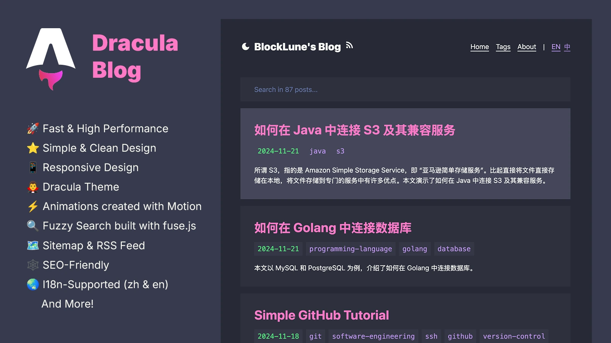

# Romiafan's Blog

<p>
    <a href="https://romiafan.com"><strong>🛑 Live Site</strong></a>&nbsp;&nbsp;/&nbsp;&nbsp;
    <a href="doc/gallery.md"><strong>🖼️Gallery</strong></a>&nbsp;&nbsp;/&nbsp;&nbsp;
    <strong>🌏 English</strong>&nbsp;&nbsp;/&nbsp;&nbsp;
    <a href="doc/readme_zh.md"><strong>🌏 简体中文</strong></a>
</p>

🌟 Personal blog of Romiafan - A Freelancer and IT Enthusiast. Built with Astro v5, featuring trilingual support (English, Chinese, Indonesian).

_Based on [Astro Dracula Blog](https://github.com/BlockLune/astro-dracula-blog) by [BlockLune](https://github.com/BlockLune)_

[](doc/gallery.md)

## :fire: Features

- [x] :rocket: Fast & High Performance
- [x] :star: Simple & Clean Design
- [x] :iphone: Responsive Design
- [x] :vampire_man: Dracula Theme
- [x] :zap: Animations created with [Motion](https://motion.dev) (the original Framer Motion)
- [x] :mag: Fuzzy Search built with [fuse.js](https://www.fusejs.io/)
- [x] :world_map: Sitemap & RSS Feed
- [x] :spider_web: SEO-Friendly
- [x] :robot: Auto [llms.txt](https://llmstxt.org/) generation (LLMs-Friendly)
- [x] :earth_asia: I18n-Supported (`en`, `zh` & `id` - Indonesian)
- [x] :triangular_ruler: Mathjax
- [x] :octocat: [GitHub Alerts](https://github.com/chrisweb/rehype-github-alerts)
- [x] :book: TOC (Table of Contents)
- [x] :framed_picture: Dynamic Open Graph Generation for Posts
- [x] :copyright: Project under MIT License & Support License customization for each post

## :white_check_mark: Performance

This blog is built with performance in mind, leveraging Astro's static site generation for optimal speed and efficiency.

## :rocket: How To Use

File structure:

```text
.
├── astro.config.mjs
├── package.json
├── public/
├── src/
│   ├── assets/
│   │   └── avatar.webp
│   ├── components/
│   ├── config.ts
│   ├── content.config.ts
│   ├── content/
│   │   ├── drafts/
│   │   │   └── ...
│   │   ├── info/
│   │   │   ├── en/
│   │   │   │   └── about.md
│   │   │   └── zh/
│   │   │       └── about.md
│   │   └── posts/
│   │       ├── en/
│   │       │   └── example-post.md
│   │       └── zh/
│   │           └── example-post.md
│   ├── middleware.ts
│   ├── pages/
│   ├── schemas/
│   ├── styles/
│   └── utils/
├── tailwind.config.mjs
└── tsconfig.json
```

To use this theme, follow these steps:

1. Edit `src/config.ts` to configure the basic information for your site. You can also configure your [umami](https://umami.is/) analytics and search engine verifications here.
2. Replace `src/assets/avatar.webp` with your own avatar.
3. Rewrite your own about page text in `src/content/info/en/about.md`, `src/content/info/zh/about.md` & `src/content/info/id/about.md` (**📌Note: Please retain the license information contained therein and, if possible, the url for this project❤️.**).
4. Delete my posts in `src/content/posts` and write your own. This blog supports English, Chinese, and Indonesian languages. For different language versions of the same post, make sure they are located in the `en`, `zh`, or `id` directories and use the same filename.
5. Remove `public/_redirects` and use your own Netlify redirect configuration.
6. Remove the icons in `public` and use your own. The commands below may be helpful:

```bash
# https://github.com/yy4382/yfi.moe/blob/main/app/blog/src/components/modules/head/Favicon.astro
mkdir magic
magick logo.png -resize 16  ./magic/favicon-16.png
magick logo.png -resize 32  ./magic/favicon-32.png
magick logo.png -resize 48  ./magic/icon-48.png
magick logo.png -resize 96  ./magic/icon-96.png
magick logo.png -resize 144 ./magic/icon-144.png
magick logo.png -resize 192 ./magic/icon-192.png
magick logo.png -resize 256 ./magic/icon-256.png
magick logo.png -resize 384 ./magic/icon-384.png
magick logo.png -resize 512 ./magic/icon-512.png
magick logo.png -resize 120 ./magic/apple-touch-icon-120.png
magick logo.png -resize 152 ./magic/apple-touch-icon-152.png
magick logo.png -resize 167 ./magic/apple-touch-icon-167.png
magick logo.png -resize 180 ./magic/apple-touch-icon-180.png
magick ./magic/favicon-32.png ./magic/favicon-16.png ./magic/favicon.ico
```

### Write a New Post

To start writing a new post, you can use the `pnpm new` command (see below), or follow these steps:

1. Create a file in `src/content/posts/en` if you are writing the English version of a post, say `hello-world.md`.
2. Edit the file `src/content/posts/en/hello-world.md` like this:

```text
---
title: Hello World
tags:
- hello
- my-first-post
date: 2024-11-12 18:50:00
---

Hello! This is my first post!

<!--more-->

I'm writing my first post!
```

Currently, Frontmatter supports the following properties

- `title`: the title of a post
- `tags`: the tags of a post
- `date`: the published date of a post
- `updated`: the updated date of a post
- `license`: the license of a post, set to `none` to disable the license for a specific post
- `licenseLink`: the license link
- `ogImageUrl`: specify an Open Graph image for a specific post

### Customize License

To customize default license, edit the `src/config.ts` file. To customize the license for a specific post, edit the `license` property in the Frontmatter of the post file.

### Customize Color Scheme

To customize the color scheme of this theme, edit the following files:

- `src/components/style/prose.astro`
- `src/styles/global.css`
- `src/styles/rehype-github-alerts.css`
- `tailwind.config.mjs`

### I18n Configuration

This blog supports English, Chinese, and Indonesian languages, with English as the default.

To switch the default language, edit `src/utils/i18n.ts`:

```ts
// For Chinese:
export const defaultLang: Lang = "zh";

// For Indonesian:
export const defaultLang: Lang = "id";
```

And update `public/_redirects` accordingly (make sure these are at the end of the file):

```text
# For Chinese default:
/ /en 302! Language=en
/ /id 302! Language=id
/ /zh 302!

# For Indonesian default:
/ /en 302! Language=en
/ /zh 302! Language=zh
/ /id 302!
```

### Useful Commands

```bash
# install dependencies
pnpm install

# start the dev server
pnpm dev

# build the project
pnpm build

# preview (after the build)
pnpm preview

# create a new post (or draft)
pnpm new
```

More detailed usage of `pnpm new` (The output of `pnpm new --help`):

```text
Usage: pnpm new [options] <post-title>

Options:
  -l, --lang <en|zh|id>  Set the language (default: en)
  -d, --draft            Create a draft post (default: false)
  -m, --mdx              Use MDX format (default: false)
  -h, --help             Show this help message

Example:
  pnpm new "Hello World"
  pnpm new -l zh "你好，世界"
  pnpm new -l id "Halo Dunia"
```

> [!Caution]
> Due to [the slug generation library used](https://www.npmjs.com/package/slugify), an empty slug will be generated for a full Chinese title like “你好，世界”, which will result in a file called `Untitled.md`.

## :memo: About This Blog

This is Romiafan's personal blog, built to share insights on software development, technology, and life experiences. As a freelancer and IT enthusiast, I wanted a platform that is:

- **Fast & Modern**: Built with Astro v5 for optimal performance
- **Multilingual**: Supports English, Chinese, and Indonesian to reach a wider audience
- **Clean & Focused**: Minimalist design that puts content first
- **Customizable**: Easy to personalize and extend

## :link: Credits & References

This blog is based on the excellent [Astro Dracula Blog](https://github.com/BlockLune/astro-dracula-blog) template by [BlockLune](https://github.com/BlockLune).

Additional references:

- [Dracula Theme](https://draculatheme.com/contribute)
- [Astro Docs](https://docs.astro.build/)
- [Tailwind CSS](https://tailwindcss.com/)
- [Motion](https://motion.dev)
